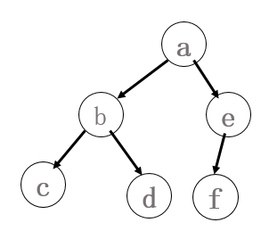
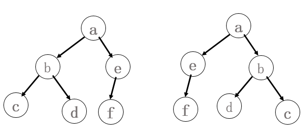
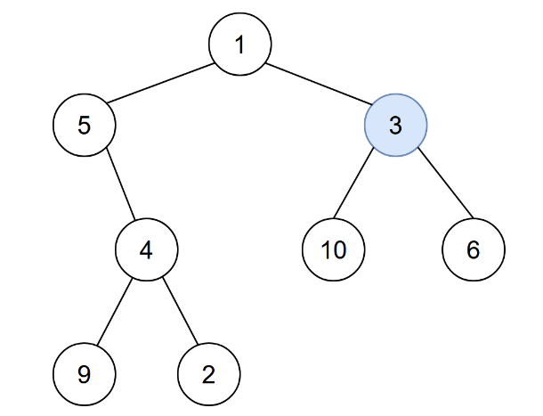
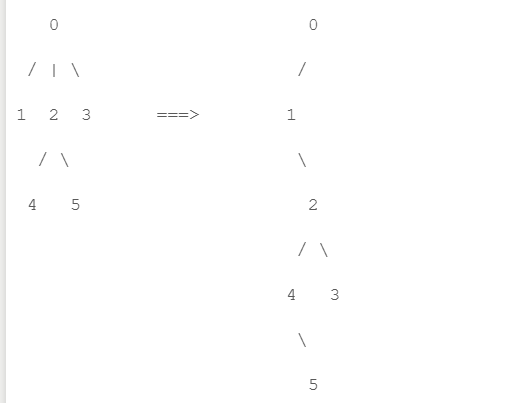

# <center> HW3 二叉树报告

#### <center> 姓名：杨瑞灵 学号：2252941

---

## 1.涉及数据结构和相关背景

- 树、二叉树的概念
- 是否建树
- 树的建立
  - 数组
  - 二叉树：parent lchild rchild
  - 非二叉树：parent child 链 firstchild 右兄弟
  - 输入顺序
  - 遍历顺序加上栈的出入顺序建树
- 树的遍历
  - 前中后序遍历
  - 层序遍历
- 遍历方式
  - 递归
  - 非递归
- 树的线索化
- 树的转化
- 转化为二叉树
- 求树的深度
  - dfs
- 树的应用
  - 表达式树

## 2.实验内容

### 2.1 二叉树的非递归遍历

#### 2.1.1 问题描述

- 二叉树的非递归遍历可通过栈来实现。例如对于由 abc##d##ef###先序建立的二叉树，如下图 1 所示，中序非递归遍历（参照课本 p131 算法 6.3）可以通过如下一系列栈的入栈出栈操作来完成：push(a) push(b) push(c) pop pop push(d)pop pop push(e) push(f) pop pop。
  
- 如果已知中序遍历的栈的操作序列，就可唯一地确定一棵二叉树。请编程输出该二叉树的后序遍历序列。
- 提示：本题有多种解法，仔细分析二叉树非递归遍历过程中栈的操作规律与遍历序列的关系，可将二叉树构造出来。

#### 2.1.2 基本要求

- 输入
  - 第一行一个整数 n，表示二叉树的结点个数。
  - 接下来 2n 行，每行描述一个栈操作，格式为：push X 表示将结点 X 压入栈中，pop 表示从栈中弹出一个结点。(X 用一个字符表示)
- 数据范围
  - 对于 20%的数据，0<n<=10
  - 对于 40%的数据，0<n<=20
  - 对于 100%的数据，0<n<=83
- 输出
  - 一行，后序遍历序列。

#### 2.1.3 数据结构设计

- 提示启发了我，加上上课的那道题，知道先序和中序求二叉树，我想应该不用做出二叉树也能直接得到答案。
- 输入的 push 顺序是先序，pop 顺序是中序，我现在求后序
- 由于先序的第一个一定是后序最后一个，所以我建立递归函数如下：
  - 找到树的 root，把先序和中序都分成子树和右子树两个字符串
  - 递归函数，传入左子树的先序和左子树的中序
  - 递归函数，传入右子树的先序和右子树的中序
  - 输出 root
- 调用上面的递归函数就可以依次输出得到后序

#### 2.1.4 功能说明

- 递归函数

```c++
void getPostOrder(string inorder, string preorder) {
    if (inorder.empty()) {
        return;
    }

    int rootIndex = inorder.find(preorder[0]);//找到第一个的位置
    if (rootIndex == string::npos)
        exit;
    string leftInorder = inorder.substr(0, rootIndex);
    string rightInorder = inorder.substr(rootIndex + 1);
    string leftPreorder = preorder.substr(1, rootIndex);
    string rightPreorder = preorder.substr(1 + rootIndex);

    getPostOrder(leftInorder, leftPreorder);
    getPostOrder(rightInorder, rightPreorder);

    cout << preorder[0];
}
```

- 主函数

```c++
int main() {
    int n;
    stack <char> Stack;
    cin >> n;
    string inorder, preorder;
    while (inorder.size() < n || preorder.size() < n) {
        string c;
        cin >> c;
        if (c == "push") {
            char z;
            cin >> z;
            Stack.push(z);
            preorder += z;
        }
        else if (c == "pop") {
            inorder += Stack.top();
            Stack.pop();
        }
        else
            break;
    }

    getPostOrder(inorder, preorder);
    cout << endl;

    return 0;
}
```

#### 2.1.5 调试分析

- 一遍过

#### 2.2.6 总结和体会

- 模拟建立二叉树当然也是一种方法，但是很显然没有这种方法简单，有时候找规律，分析其中的细节和原理，让大脑多工作一些，可以简化计算机的工作。

</br>
</br>

---

### 2.2 二叉树的同构

#### 2.2.1 问题描述

- 给定两棵树 T1 和 T2。如果 T1 可以通过若干次左右孩子互换变成 T2，则我们称两棵树是“同构”的。例如图 1 给出的两棵树就是同构的，因为我们把其中一棵树的结点 a、b、e 的左右孩子互换后，就得到另外一棵树。而图 2 就不是同构的。
  

- 现给定两棵树，请你判断它们是否是同构的。并计算每棵树的深度。

#### 2.2.2 基本要求

- 输入:
  - 第一行是一个非负整数 N1，表示第 1 棵树的结点数；
  - 随后 N 行，依次对应二叉树的 N 个结点（假设结点从 0 到 N−1 编号），每行有三项，分别是 1 个英文大写字母、其左孩子结点的编号、右孩子结点的编号。如果孩子结点为空，则在相应位置上给出“-”。给出的数据间用一个空格分隔。
  - 接着一行是一个非负整数 N2，表示第 2 棵树的结点数；
  - 随后 N 行同上描述一样，依次对应二叉树的 N 个结点。
- 数据范围
  - 对于 20%的数据，有 0<N1=N2<=10
  - 对于 40%的数据，有 0<=N1=N2<=100
  - 对于 100%的数据，有 0<=N1,N2<=10100
- 注意：题目不保证每个结点中存储的字母是不同的。

- 输出:
  - 共三行。
  - 第一行，如果两棵树是同构的，输出“Yes”，否则输出“No”。
  - 后面两行分别是两棵树的深度。

#### 2.2.3 数据结构设计

- 结构体包括数据（A，B...），左子树标号（0，1，...）,左子树标号（0，1，...），双亲树的标号（0，1，...）
- 物理结构用**数组**来存放结构体，输入的顺序就是存放的顺序
- 求深度
- 判断

  - 两个树的深度不一样时判断为不同构
  - 对于每一个节点以及这个节点的子树情况进行判断，进行递归调用

    - 如果两个数的节点都不存在，返回 true
    - 如果只有一个树的节点不存在，返回 false
    - 如果节点存储的字母不同返回 false
    - 如果 tree1 的左树和 tree2 的左树，tree1 的右树和 tree2 的右树都同构返回 true
    - 如果 tree1 的左树和 tree2 的右树，tree1 的右树和 tree2 的左树都同构返回 true

  - 我们看到甚至不需要交换左右树

- 节点结构设计：

```c++
typedef struct Node {
	char c;
	int lchild;
	int rchild;
	int parent;
	void init()
	{
		c = '\0';
		lchild = -1;
		rchild = -1;
		parent = -1;
	}
}Tree;
```

#### 2.2.4 功能说明

- 输入并给出根节点

```c
void f_in(Tree tree[], int& root, int& n)
{
	cin >> n;
	for (int i = 0; i < n; i++)
		tree[i].init();
	for (int i = 0; i < n; i++)
	{
		int t;
		cin >> tree[i].c;
		cin >> t;
		//读入左孩子
		if (cin.good())
		{
			tree[i].lchild = t;
			tree[t].parent = i; //parent节点记录为i
		}
		else //当输入为'-'的时候就会输入错误，记为0
			cin.clear();
		cin >> t;
		//读入右孩子
		if (cin.good())
		{
			tree[i].rchild = t;
			tree[t].parent = i; //parent节点记录为i
		}
		else //当输入为'-'的时候就会输入错误，记为空
			cin.clear();
	}
	//没有parent的节点就是根节点
	for (int i = 0; i < n; i++)
	{
		if (tree[i].parent == -1)
		{
			root = i;
			break;
		}
	}
}
```

- 求树的深度

```c++
int Depth(const int i, const Tree tree[])
{
	int deepl = 0, deepr = 0;
	if (tree[i].c) {
		if (tree[i].lchild != -1)
			deepl = Depth(tree[i].lchild, tree);
		if (tree[i].rchild != -1)
			deepr = Depth(tree[i].rchild, tree);
		return max(deepl, deepr) + 1;
	}
	return 0;
}
```

- 判断是否同构

```c++
bool judge(int i1, int i2, Tree tree1[], Tree tree2[])
{
	if (i1 == -1 && i2 == -1)
		return true;
	if (i1 == -1 || i2 == -1)
		return false;
	if (tree1[i1].c && tree2[i2].c && tree1[i1].c == tree2[i2].c) {
		if (judge(tree1[i1].lchild, tree2[i2].lchild, tree1, tree2) && judge(tree1[i1].rchild, tree2[i2].rchild, tree1, tree2))
			return true;
		else if (judge(tree1[i1].lchild, tree2[i2].rchild, tree1, tree2) && judge(tree1[i1].rchild, tree2[i2].lchild, tree1, tree2))
			return true;
	}
	return false;
}
```

- 主函数

```c++
int main()
{
	//建树
	int n1, n2;
	Tree tree1[10200];
	Tree tree2[10200];
	int root1, root2;
	f_in(tree1, root1,n1);
	f_in(tree2, root2,n2);
	//求树的深度
	int size1 = Depth(root1, tree1);
	int size2 = Depth(root2, tree2);
	//是否同构
	if (size1 != size2)
		cout << "No" << endl;
	else if (judge(root1, root2,tree1,tree2))
		cout << "Yes" << endl;
	else
		cout << "No" << endl;
	//输出深度
	cout << size1 << endl;
	cout << size2 << endl;
	return 0;
}
```

#### 2.2.5 调试分析

- 第一次调试没有判断孩子节点不存在的情况，因为不存在 lchild，rchild 为-1 而不是 0，所以应该单独判断是否==-1 而不是直接当成 bool 值

#### 2.2.6 总结和体会

- 考虑全递归的出口有几个，分别是什么条件，不能漏掉条件，也不要重叠，尽可能简化
- 可以通过将这一层需要判读的情况放到下一层递归来简化递归逻辑（判断条件）
- 在接数据时要充分考虑到数据的范围，选择合适的变量来进行存储

</br>
</br>

---

### 2.3 感染二叉树需要的总时间

#### 2.3.1 问题描述

- 给你一棵二叉树的根节点 root ，二叉树中节点的值 互不相同 。另给你一个整数 start 。在第 0 分钟，感染 将会从值为 start 的节点开始爆发。
- 每分钟，如果节点满足以下全部条件，就会被感染：
  - 节点此前还没有感染。
  - 节点与一个已感染节点相邻。
  - 返回感染整棵树需要的分钟数。
    
- 例如上图中 start = 3，输出：4
- 解释：节点按以下过程被感染： - 第 0 分钟：节点 3 - 第 1 分钟：节点 1、10、6 - 第 2 分钟：节点 5 - 第 3 分钟：节点 4 - 第 4 分钟：节点 9 和 2 感染整棵树需要 4 分钟，所以返回 4 。

#### 2.3.2 基本要求

- 输入
  - 第一行包含两个整数 n 和 start
  - 接下来包含 n 行，描述 n 个节点的左、右孩子编号
  - 0 号节点为根节点，0<=start<n
  - 对于 20%的数据，1<=n<=10
  - 对于 40%的数据，1<=n<=1000
  - 对于 100%的数据，1<=n<=100000
- 输出
  - 一个整数，表示感染整棵二叉树所需要的时间

#### 2.3.3 数据结构设计

- 与上一题的输入差不多，依然使用**线性的物理结构：数组**
- **二叉树的逻辑结构**，包括：左右孩子的下标，自己的下标，parent 的下标
- 相当于**迷宫问题**，找出从 start 开始，有三个方向：左孩子、右孩子、parent 的最长路径。**用 dfs 或者 bfs**
  - dfs 时间复杂度较大但是空间复杂度较小
  - bfs 的实现更为适合迷宫问题，所以我选择 bfs

```c++
typedef struct Node {
	int lchild;
	int rchild;
	int parent;
	int num;
	void init()
	{
		parent = -1;
		lchild = -1;
		rchild = -1;
		num = -1;
	}
}Tree;
```

#### 2.3.4 功能说明

- 输入函数

```c++
void f_in(Tree tree[], const int n)
{
	for (int i = 0; i < n; i++)
		tree[i].init();
	for (int i = 0; i < n; i++)
	{
		int t;
		cin >> t;
		//读入左孩子
		tree[i].lchild = t;
		if (t != -1)
			tree[t].parent = i; //parent节点记录为i
		cin >> t;
		//读入右孩子
		tree[i].rchild = t;
		if (t != -1)
			tree[t].parent = i; //parent节点记录为i
		tree[i].num = i;
	}
}
```

- dfs

```c++
int d[100100];
queue <Node>que;
int dfs(const int index, const Tree tree[], const int n)
{
    //把所有的位置都初始化为INF
	for (int i = 0; i < n; i++)
		d[i] = -1;
	//将start加入队列，并把这一地点的距离设置为0
    que.push(tree[index]);
    d[index] = 0;
    //不断循环直到队列的长度为0
    while (que.size())
    {
        //从队列的最前端取出元素
        Node p = que.front();
        que.pop();

        //三个方向的循环
		//左子树
		if (p.lchild != -1 && d[p.lchild] == -1) {//有左子树且左子树没有被遍历到
			que.push(tree[p.lchild]);
			d[p.lchild] = d[p.num] + 1;
		}
		if (p.rchild != -1 && d[p.rchild] == -1) {//有右子树且右子树没有被遍历到
			que.push(tree[p.rchild]);
			d[p.rchild] = d[p.num] + 1;
		}
		if (p.parent != -1 && d[p.parent] == -1) {//有parent树且parent树没有被遍历到
			que.push(tree[p.parent]);
			d[p.parent] = d[p.num] + 1;
		}
    }
	int longest = 0;
	for (int i = 0; i < n; i++) {
		if (d[i] > longest)
			longest = d[i];
	}
    return longest;
}
```

- 主函数

```c++
Tree tree[100100];
int main()
{
	int n, start;
	cin >> n >> start;
	f_in(tree, n);
	int longest = dfs(start, tree, n);
	cout << longest << endl;
	return 0;
}
```

#### 2.3.5 调试分析

- 一遍过

#### 2.3.6 总结和体会

- 我们看到虽然这道题是二叉树的逻辑结构，但是实际上我们没有区分孩子和双亲，而是等价的当成方向的三个维度，当成迷宫问题
- 时间复杂度是$O(3n)$

### 2.4 树的重构

#### 2.4.1 问题描述

- 树木在计算机科学中有许多应用。 也许最常用的树是二叉树，但也有其他的同样有用的树类型。 其中一个例子是有序树（任意节点的子树是有序的）。
- 每个节点的子节点数是可变的，并且数量没有限制。 一般而言， 有序树由有限节点集合 T 组成，并且满足：
  - 1.其中一个节点置为根节点，定义为 root(T);
  - 2.其他节点被划分为若干子集 T1,T2,...Tm,每个子集都是一个树.
- 同样定义 root(T1),root(T2),...root(Tm)为 root(T)的孩子，其中 root(Ti)是第 i 个孩子。节点 root(T1),...root(Tm)是兄弟节点。
- 通常将一个有序树表示为二叉树是更加有用的，这样每个节点可以存储在相同内存空间中。有序树到二叉树的转化步骤为：
  - 1.去除每个节点与其子节点的边
  - 2.对于每一个节点，在它与第一个孩子节点（如果存在）之间添加一条边，作为该节点的左孩子
  - 3.对于每一个节点，在它与下一个兄弟节点（如果存在）之间添加一条边，作为该节点的右孩子
    
- 在大多数情况下，树的深度（从根节点到叶子节点的边数的最大值）都会在转化后增加。这是不希望发生的事情因为很多算法的复杂度都取决于树的深度。

#### 2.4.2 基本要求

- 输入
  - 输入由多行组成，每一行都是一棵树的深度优先遍历时的方向。其中 d 表示下行(down)，u 表示上行(up)。
  - 例如上面的树就是 dudduduudu,表示从 0 下行到 1,1 上行到 0,0 下行到 2 等等。输入的截止为以#开始的行。
  - 可以假设每棵树至少含有 2 个节点，最多 10000 个节点。
- 输出
  - 对每棵树，打印转化前后的树的深度，采用以下格式 Tree t: h1 => h2。其中 t 表示样例编号(从 1 开始)，h1 是转化前的树的深度，h2 是转化后的树的深度。

#### 2.4.3 数据结构设计

- 由于一些离谱的输出格式问题所以写了两种方法：

  - 树的深度：直接“d”加 1，“u”减 1 为当下节点的深度，输出最大值
  - 二叉树的深度方法一：

    - **构建树**。树存放 data：这是转化前这一层的第几个孩子；树存放 parent
    - 循环，遇见 d 就深度加 1，遇见 ud 深度加一，遇见 u 且后面不是 d 深度减去 data
    - 方法一构建树结构体

    ```c++
        typedef struct Node {
        int parent = -1;//parent编号
        int data = 1;//这一层的第几个孩子
    }Tree;
    Tree TREE[2000000];
    ```

  - 二叉树的深度方法二：
    - 不构建树
    - **dfs 递归**，遇见“d”进入下一层递归 depth 加 1，遇见“u”return 回到上一层

#### 2.4.4 功能说明

##### 方法一

```c++
int main()
{
    string s;
    int longest_tree, longest_twotree;
    int longest_tree_tem, longest_twotree_tem;
    int cou = 0;
    while (1) {
        cin >> s;
        if (s == "#")
            break;
        cou++;
        longest_tree = 0;
        longest_twotree = 0;
        longest_tree_tem = 0;
        longest_twotree_tem = 0;
        int Size = s.size();
        int p = 0;//永远指向当下节点位置
        int tree_num = 0;//这一节点的位置
        for (int i = 0; i < Size; i++) {
            if (s[i] == 'd') {
                tree_num++;//
                TREE[tree_num].parent = p;//
                TREE[tree_num].data = 1;
                p = tree_num;
                longest_tree_tem++;
                longest_tree = max(longest_tree, longest_tree_tem);
            }
            else {//s[i]=='u'
                p = TREE[p].parent;
                longest_tree_tem--;
            }
        }
        //dudduduudu
        p = 0;
        tree_num = 0;
        for (int i = 0; i < Size; i++) {
            if (s[i] == 'd') {
                tree_num++;//
                p = tree_num;//
                longest_twotree_tem++;
                longest_twotree = max(longest_twotree, longest_twotree_tem);
            }
            else {//s[i]=='u'
                if (i + 1 < Size && s[i + 1] == 'd') {
                    tree_num++;//
                    TREE[tree_num].data = TREE[p].data + 1;//
                    p = tree_num;//

                    longest_twotree_tem++;
                    longest_twotree = max(longest_twotree, longest_twotree_tem);
                    i++;
                }
                else {
                    longest_twotree_tem -= TREE[p].data;
                    p = TREE[p].parent;//
                }
            }
        }
        cout << "Tree " << cou << ": " << longest_tree << " => " << longest_twotree << endl;//Tree 1: 2 => 4
    }
}
```

##### 方法二 dfs

```c++
void dfs(int& longest_twotree, int width, int& i)
{
	while (s[i]) {
		if (s[i] == 'd') {
			width++;
			longest_twotree = max(width, longest_twotree);
			i++;
			dfs(longest_twotree, width, i);
		}
		else {
			i++;
			return;
		}
	}
	return;
}
```

#### 2.4.5 调试分析

- 方法一的时候最开始我遇见“u”直接减 1，但是这样不对，对于第 n 个孩子回到 parent，二叉树层数应该减 n，所以我选择构建树存储它是第几个孩子以及 parent 是谁
- 注意输出格式

#### 2.4.6 总结和体会

- dfs 对这道题挺有用的不需要构建二叉树，因为都有层次的调用，回到上一层相当于出栈
- 其实我的方法一构建树也是一样记录 parent，并且“u”时候减 data，手动回到上一层，其实 dfs 会更简单一些

### 2.5 求树的后序

#### 2.5.1 问题描述

- 给出二叉树的前序遍历和中序遍历，求树的后序遍历

#### 2.5.2 基本要求

- 输入
  - 输入包含若干行，每一行有两个字符串，中间用空格隔开
  - 同行的两个字符串从左到右分别表示树的前序遍历和中序遍历，由单个字符组成，每个字符表示一个节点
  - 字符仅包括大小写英文字母和数字，最多 62 个
  - 输入保证一颗二叉树内不存在相同的节点
- 输出
  - 每一行输入对应一行输出
  - 若给出的前序遍历和中序遍历对应存在一棵二叉树，则输出其后序遍历
  - 否则输出 Error

#### 2.5.3 数据结构设计

- 和 2.1 一样的方法，不需要建立树采用循环，只用改一改中间 Error 的判断
- 设全局变量 Error，如果错误置为 1，每一层都直接 return
- 由于先序的第一个一定是后序最后一个，所以我建立递归函数如下：
  - 找到树的 root，把先序和中序都分成子树和右子树两个字符串
  - 递归函数，传入左子树的先序和左子树的中序
  - 递归函数，传入右子树的先序和右子树的中序
  - 输出 root
- 调用上面的递归函数就可以依次输出得到后序

#### 2.1.4 功能说明

- 判断 Error

```c++
if (rootIndex == string::npos)
{
    error = 1;
    return;
}
```

- 递归函数整体

```c++
int error = 0;
string fout;
void getPostOrder(string inorder, string preorder) {
    if (inorder.empty() || error == 1) {
        return;
    }
    int rootIndex = inorder.find(preorder[0]);//找到第一个的位置
    if (rootIndex == string::npos)
    {
        error = 1;
        return;
    }
    string leftInorder = inorder.substr(0, rootIndex);
    string rightInorder = inorder.substr(rootIndex + 1);
    string leftPreorder = preorder.substr(1, rootIndex);
    string rightPreorder = preorder.substr(1 + rootIndex);

    getPostOrder(leftInorder, leftPreorder);
    getPostOrder(rightInorder, rightPreorder);
    fout += preorder[0];
}
}
```

- 主函数

```c++
int main() {
    string inorder, preorder;
    while (1) {
        error = 0;
        fout = "";
        cin >> preorder >> inorder;
        if (cin.eof())
            break;
        /*if (preorder.size()==0 && inorder.size()==0)
            break;*/
        if (preorder.size() != inorder.size())
        {
            cout << "Error" << endl;
            continue;
        }
        getPostOrder(inorder, preorder);
        if (error == 1)
        {
            fout = "Error";
        }
        cout << fout << endl;
    }
    return 0;
}
```

#### 2.5.5 调试分析

- 一遍过

#### 2.5.6 总结和体会

- 模拟建立二叉树当然也是一种方法，但是很显然没有这种方法简单，有时候找规律，分析其中的细节和原理，让大脑多工作一些，可以简化计算机的工作。

## 3. 实验总结

- 选择是否建树

  - 虽然是二叉树的题但是很多时候不需要用到二叉树比如 2.3 感染可以归结成 bfs
  - 2.1 2.5 都可以用递归直接求出答案
  - 2.4 可以 dfs 递归实现回溯

- 树的建立

  - 数组是常用的方法
    - 如果是二叉树一般存储 parent 和 lchild 和 rchild。
  - 如果是普通的树一般存储 parent，第一个 child 和右兄弟，因为可以直接转成二叉树
  - 可以通过确定前序中序或者后序序列进行建树，或者通过进栈出栈顺序进行建树
  - 可以通过输入的顺序建树

- 树的遍历

  - 前中后序遍历
  - 层序遍历
    - 利用 bfs 实现层序遍历，2.3 实现最长路径问题虽然不是层序遍历但是也用了相同的方法
  - 遍历方式

    - 递归 通过变化递归顺序来进行遍历

      - 事实上可以通过增加一个参数来进行模式的选择

      ```c++
      void PrintByMode(Node* node, int mode)
      {
          if( mode == 1 )
      	    out << c;
          if( node->l )
      	    PrintByMode(node->l, mode);
          if( mode == 2 )
      	    out << c;
          if( node->r )
      	    PrintByMode(node->r, mode);
          if( mode == 3 )
      	    out << c;
      }
      ```

    - 非递归
      - 利用入栈出栈的先后顺序模拟递归
      - 其中前序：打印根节点， 左子树遍历完，出栈完，右子树遍历完，出栈完
      - 中序：左子树遍历完，出栈完，打印根节点， 右子树遍历完，出栈完
      - 后序： 左子树遍历完，出栈完，右子树遍历完，出栈完，打印根节点， 打印根节点（利用指针记录已经访问过的节点或者在节点处增加计数器，记录访问次数，两次就将根节点输出）

  - 树的线索化
    - ltag, rtag
  - 调整处理 p->l,p->r,p 的顺序就可以实现先序中序后序的遍历顺序
    ```c++
    void inTheading(Node\* p)
    {
        if (p){
            inTheading(p->l);
            if (!p->l){
                p->ltag = 1;
                p->l = pre;
            }
            if (pre != NULL && !pre->r){
                pre->rtag = 1;
                pre->r = p;
            }
            pre = p;
            inTheading(p->r);
        }
    }
    ```
    - 注意线索化是逻辑结构，不是物理结构，在实际的图表示中，并不是真正的双向链表连接

- 树的转化
  - 转化为二叉树
    - 求二叉树的深度
    - 二叉树节点的深度
- 求树的深度
  - dfs
  - 二叉树的深度
    - **当前节点深度=父节点深度+当前节点左兄弟数量**
- 树的应用
  - 表达式树
  - 树的打印
